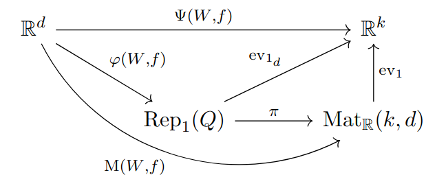

# Knowledge Matrix



Given a neural network (W,f) [1] with network function Ψ(W,f) and an input x ∈ ℝᵈ, compute the knowledge matrix M(W,f)(x). 
They were introduced in [2] and studied further in [3]. 

#### References 

[1] Armenta, M., Jodoin, P-M., <a href="https://arxiv.org/abs/2007.12213" target="_blank">The Representation Theory of Neural Networks</a> (2021)

[2] Armenta, M., Brüstle, T., Hassoun, S., Reineke, M., <a href="https://arxiv.org/abs/2109.14589" target="_blank">Double framed moduli spaces of quiver representations</a> (2021)

[3] Leblanc, S., Rasolomanana, A., Armenta, M., <a href="https://arxiv.org/abs/2409.13163" target="_blank">Hidden Activations Are Not Enough: A General Approach to Neural Network Predictions</a> (2024)

## Download & Use

You can download this using

```
pip install git+https://github.com/samueleblanc/knowledgematrix.git
```

For an example on how to use, please refer to [example.py](example.py).

## Contributing

Any contribution is welcomed. Thank you in advance! 
However, we are primarily interested with help on the following:

* Implement other type of layers or other architecture.
* Improve memory efficiency or speed.

To set up, once the code is downloaded, simply run 
```
pip install -e .
```
in the root directory. 
Then, to run a file, for instance the test for AlexNet, run
```
python extra/tests/alexnet.py
```
again from the root directory.

## Authors

This code was written by Marco Armenta and Samuel Leblanc.

## License

MIT